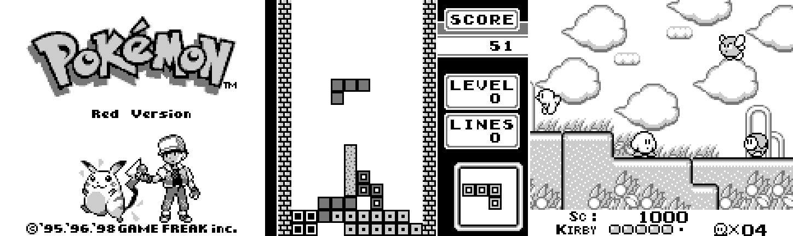
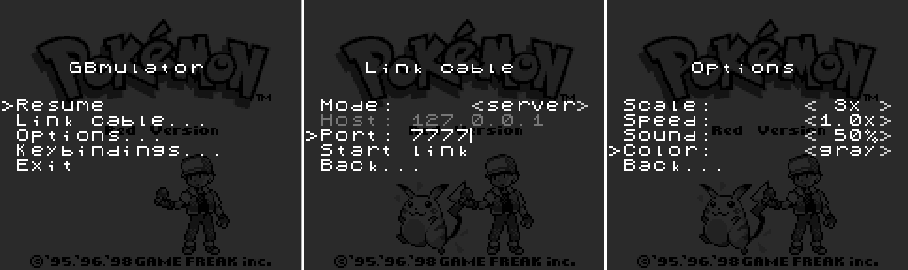

# GBmulator
A Game Boy Color emulator with sound and serial data transfer (link cable) support over tcp.

You can compile and run it on your machine or use it in your browser [here](https://mpostaire.github.io/gbmulator) (the link cable doesn't work in the browser version).

## Screenshots

TODO gameboy color screenshots

GBmulator running some games:



GBmulator's menus:



## Installation

```sh
# 1. Clone this repository
git clone https://github.com/mpostaire/gbmulator.git
# 2. cd into the cloned repository
cd gbmulator
# 3. Compile gbmulator
make
# 4. Install gbmulator
sudo make install
# Optional: Uninstall gbmulator
sudo make uninstall
```

## Usage

To launch the emulator you must call it from the command line with the path of a rom as the first argument.
```sh
gbmulator path/to/rom.gb
```

## Key bindings

The following table show the default keybindings (they can be changed in GBmulator's menus except those marked with a '*').

|Action|Key|
|---|---|
|UP|Up arrow|
|DOWN|Down arrow|
|LEFT|Left arrow|
|RIGHT|Right arrow|
|A|NUMPAD 0|
|B|NUMPAD period|
|START|NUMPAD 1|
|SELECT|NUMPAD 2|
|*Options menu|ESCAPE or PAUSE|
|*Load savesate 1->8|F1->F8|
|*Create savesate 1->8|SHIFT + F1->F8|

There is also support for gamepad controllers but the buttons aren't configurable.

## TODO

- fix mbc bugs + implement MBC6, MBC7, HuC1 and multicart MBCs
- better audio/video sync
- rewrite ppu from scanline rendering to cycle accurate rendering
- fix buggy serial data transfer

## Resources used
- https://gbdev.io/pandocs/
- http://marc.rawer.de/Gameboy/Docs/GBCPUman.pdf
- https://izik1.github.io/gbops/
- https://gbdev.gg8.se/wiki/
- https://www.youtube.com/watch?v=HyzD8pNlpwI
