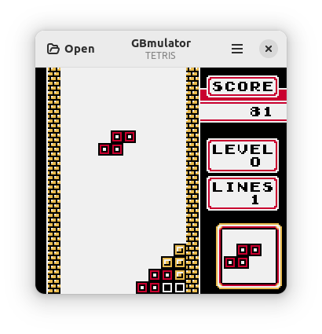
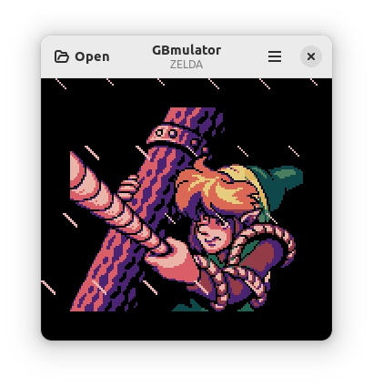

# GBmulator
A Game Boy Color emulator with sound and wireless link cable support.

You can compile and run it on your linux machine or use it in your browser [here](https://mpostaire.github.io/gbmulator) (Note: the browser version does not have support for the link cable).

## Screenshots






## Features

- GameBoy and GameBoy Color emulator
- PPU implements fifo rendering
- Audio
- Wireless link cable
- Support for MBC1, MBC1M, MBC2, MBC3, MBC30, MBC5, MBC7 and HuC1 cartridges
- Battery saves and savestates
- Game Boy Printer emulation
- Supports keyboard and gamepad controllers

## Installation

Various dependencies are needed to build the desktop app:

- libadwaita
- libmanette
- opengl
- glew
- openal
- zlib (optional: enables compressed savestates)

In addition to these dependencies, the following tools are needed to build the desktop app:

- make
- gcc
- rgbds
- imagemagick

### Installation process

```sh
# 1. Clone this repository
git clone https://github.com/mpostaire/gbmulator.git
# 2. cd into the cloned repository
cd gbmulator
# 3. Compile gbmulator
make
# 4. Install gbmulator
sudo make install
# To uninstall gbmulator, run the following command
sudo make uninstall
```

## Usage
After installation, GBmulator should be available from the app launcher of your desktop environment.
You can also call it from the command line with the (optional) path of a rom as the first argument.
```sh
gbmulator path/to/rom.gb
```

## Key bindings

The following table show the default keybindings (they can be changed in GBmulator's menus except those marked with a '*').

| Action                 | Key                                              |
| ---------------------- | ------------------------------------------------ |
| UP                     | <kbd>Up</kbd>                                    |
| DOWN                   | <kbd>Down</kbd>                                  |
| LEFT                   | <kbd>Left</kbd>                                  |
| RIGHT                  | <kbd>Right</kbd>                                 |
| A                      | <kbd>Numpad 0</kbd>                              |
| B                      | <kbd>Numpad period</kbd>                         |
| START                  | <kbd>Numpad 1</kbd>                              |
| SELECT                 | <kbd>Numpad 2</kbd>                              |
| *Load savesate 1 → 8   | <kbd>F1</kbd> → <kbd>F8</kbd>                    |
| *Create savesate 1 → 8 | <kbd>Shift</kbd> + <kbd>F1</kbd> → <kbd>F8</kbd> |

There is also support for gamepad controllers.

### TODO

- implement other MBCs
- implement printer
- implement GBC and HuC1 IR
- find out what are the accurate timings for the ppu pixel fifo/fetcher (especially for corner cases)
- better audio/video sync
- android link cable via bluetooth + cross platform link cable
- Maybe: web link cable using Emscripten WebSockets API (https://emscripten.org/docs/porting/networking.html and https://github.com/emscripten-core/emscripten/blob/main/system/include/emscripten/websocket.h. Example gist: https://gist.github.com/nus/564e9e57e4c107faa1a45b8332c265b9)
- rewrite Makefile (it's a mess) maybe use CMake instead

## Resources used

- https://gbdev.io/pandocs/
- http://marc.rawer.de/Gameboy/Docs/GBCPUman.pdf
- https://gekkio.fi/files/gb-docs/gbctr.pdf
- https://izik1.github.io/gbops/
- https://gbdev.gg8.se/wiki/
- https://www.youtube.com/watch?v=HyzD8pNlpwI
- https://github.com/AntonioND/giibiiadvance/blob/master/docs/TCAGBD.pdf
- https://pixelbits.16-b.it/GBEDG/ppu/
- https://shonumi.github.io/articles/art2.html
